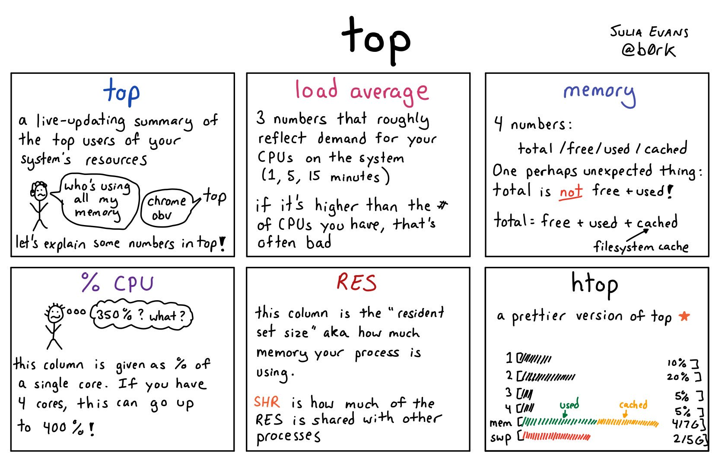
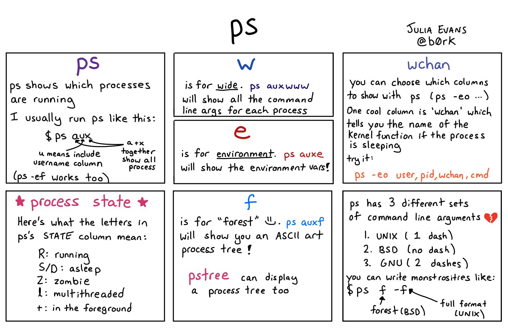
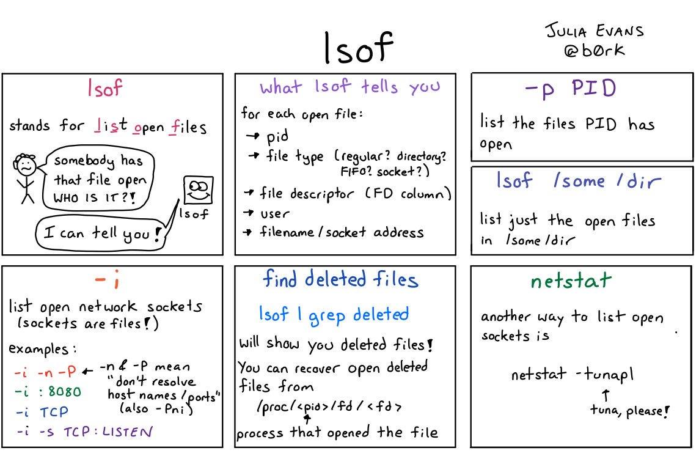
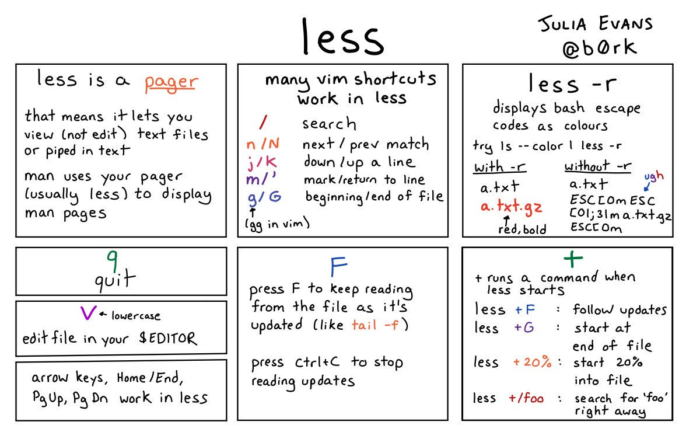
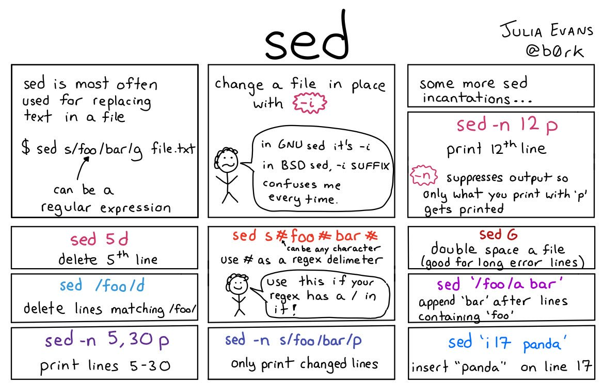
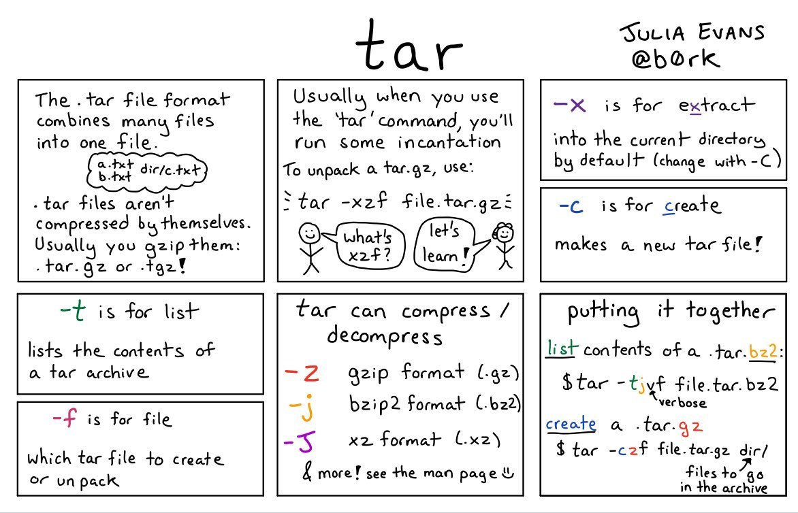

# b0rk
Quick access to zines from Julia Evans

# BSD Not Equal GNU

[tweet](https://twitter.com/b0rk/status/1023035232608571392)

## ip

[tweet](https://twitter.com/b0rk/status/1053674763107876866)

## iptables

[tweet](https://twitter.com/b0rk/status/1054056111626686465)

## disk usage

[tweet](https://twitter.com/b0rk/status/1000953701090103302)

## top

[tweet](https://twitter.com/b0rk/status/1022331694811099137)

## ps

[tweet](https://twitter.com/b0rk/status/1022322609789329408)

## dig

[tweet](https://twitter.com/b0rk/status/1053137897497546752)

## lsof

[tweet](https://twitter.com/b0rk/status/1022699735482810368)

## head & tail

[tweet](https://twitter.com/b0rk/status/1023048952332124160)

## cat

[tweet](https://twitter.com/b0rk/status/1018269213096587266)

## less

[tweet](https://twitter.com/b0rk/status/1005470181240508417)

## sed

[tweet](https://twitter.com/b0rk/status/1000773086155804672)

## awk

[tweet](https://twitter.com/b0rk/status/1000604334026055681)

## misc commands

[tweet](https://twitter.com/b0rk/status/1000235694118395904)

## bash tricks

[tweet](https://twitter.com/b0rk/status/1000208860060307456)

## kill

[tweet](https://twitter.com/b0rk/status/994203063194963969)

## find

[tweet](https://twitter.com/b0rk/status/993862211964735488)

## tar

[tweet](https://twitter.com/b0rk/status/993682480069824512)

## sort & uniq

[tweet](https://twitter.com/b0rk/status/993507639148662785)

## xargs

[tweet](https://twitter.com/b0rk/status/992636366075973633)

## grep

[tweet](https://twitter.com/b0rk/status/991880504805871616)

## what's in a process

[tweet](https://twitter.com/b0rk/status/983705730036285441)

## openssl

[tweet](https://twitter.com/b0rk/status/1087524713939722240)

## ssh

[tweet](https://twitter.com/b0rk/status/1087936439470444544)

## ping & traceroute

[tweet](https://twitter.com/b0rk/status/1088647566949056512)
	
	
## curl

[tweet](https://twitter.com/b0rk/status/1088981000955355136)

## ss

[tweet](https://twitter.com/b0rk/status/1090058524137345025)

## tc

[tweet](https://twitter.com/b0rk/status/1090458969234173953)

## netcat

[tweet](https://twitter.com/b0rk/status/1059651145461723139)

## conntrack

[tweet](https://twitter.com/b0rk/status/1059109780059504641)

## socat

[tweet](https://twitter.com/b0rk/status/1059659488364556288)

## tcpdump

[tweet](https://twitter.com/b0rk/status/1091722736412606464)

## tshark

[tweet](https://twitter.com/b0rk/status/1091733136935923717)
